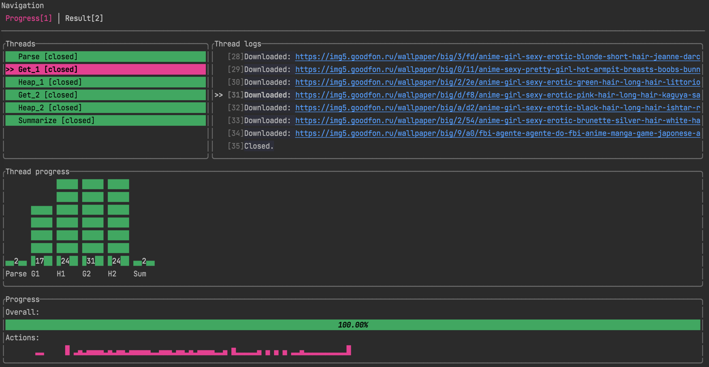

## mium - medium image

A simple exercise to play with threads


#### What it does

It downloads images from the internet and unites them into 1 image. Accumulation is just a sum of pixels divided by its
amount. It takes every x/y pixel from each image, summarizes them all and divides by amount of images. The obtained
pixel will be a part of result image.

#### How it does

All images are taken from https://www.goodfon.com/

There are 4 types of threads:

- Parse - Makes `GET` requests to the site, parses html and grabs urls from `img` tags(every page has 24 images). Sends
  these urls to the `crossbeam` multi consumer channel. All requests are done asynchronously at the same time.
- Get - Consumes urls from the channel, downloads them asynchronously, decodes and pushes to the next channel
- Heap - Consumes images from the channel and generates medium image of the gotten batch. Sends the result image to the
  next channel
- Summarize - Consumes "medium-result" images from the heap threads and does the same job - makes medium of mediums :D
  Then saves result to the fs

#### How to use

```

USAGE:
    mium [OPTIONS]

FLAGS:
    -h, --help       Prints help information
    -V, --version    Prints version information

OPTIONS:
    -f, --file <file>       [default: result]   filename of the result image
    -p, --pages <pages>     [default: 2]        number of pages to parse
    -q, --query <query>     [default: anime]    the query to search by

```